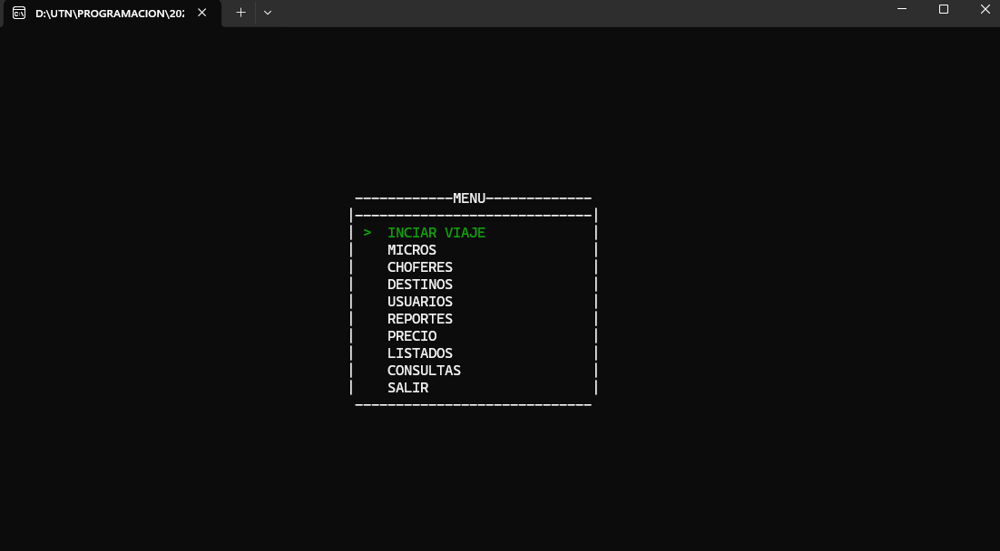
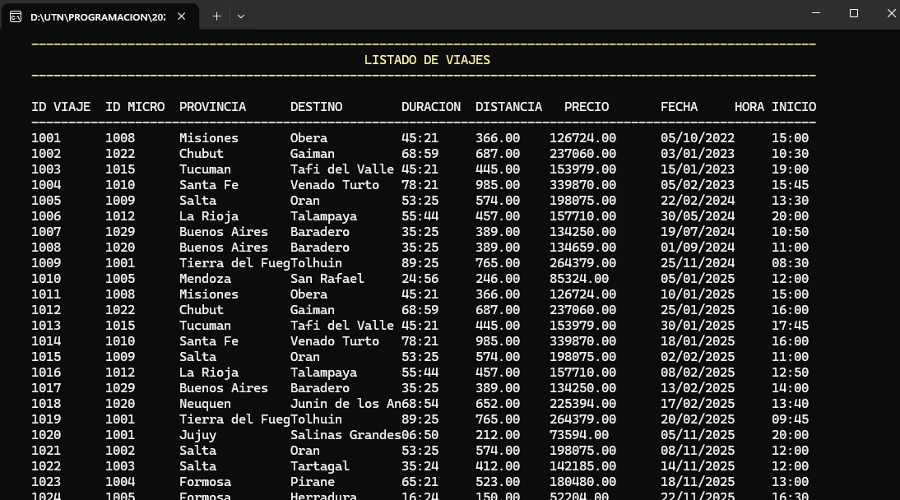
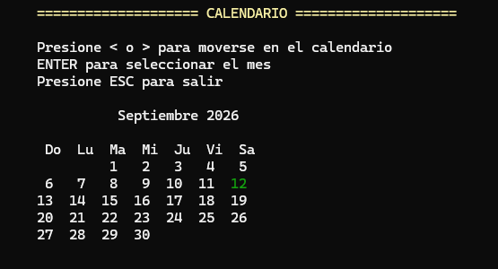
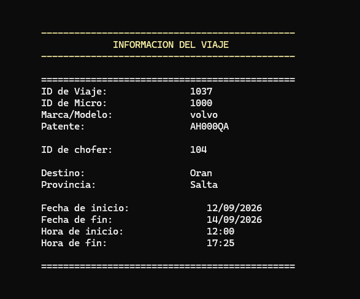

🧭 Estructura sugerida del README
1. 🎯 Descripción del proyecto
Sistema de gestión de transporte de pasajeros desarrollado en C++ como trabajo práctico para la materia Programación II - UTN. Permite administrar el ciclo completo de una empresa de micros: desde los vehículos y choferes hasta la venta de pasajes y generación de reportes.

2. ✨ Funcionalidades principales
Organizadas en módulos:

👤 Usuarios — Login con contraseña, niveles de acceso, historial de ingresos

🚌 Micros (Unidades) — Alta/baja/modificación, patente, capacidad, tipo de butaca

👨‍✈️ Choferes — ABM completo, mail, teléfono

📍 Destinos y Provincias — Gestión de rutas con distancia en km y duración del viaje

🗓️ Viajes — Programación de viajes con fecha/hora inicio y fin, chofer y micro asignados

🎫 Venta de Pasajes — Selección de butacas, cálculo de precio automático

💲 Precios — Configuración de precio por km y por tipo de butaca

📊 Reportes — Por año, por micro, por destino, por género, kilómetros por micro, recaudación

📋 Listados ordenados — Choferes, pasajeros, micros, ventas y destinos con diferentes criterios de orden

🔍 Consultas — Por DNI, apellido, destino, ID, tipo de butaca, etc.

3. 🏗️ Arquitectura del código
Clases con herencia: Persona → Usuario, Chofer, Pasajero
Persistencia en archivos binarios (.dat) para cada entidad
Separación en clases de entidad (MICROS.h, VIAJES.h...) y clases de archivo (ARCHIVO_MICROS.h...)
Interfaz visual en consola usando rlutil (colores, posicionamiento del cursor)

4. ⚙️ Requisitos y compilación
Compilador: MinGW GCC 6.3.0 (32-bit)
Librerías: SFML 2.x (incluida en el proyecto, no implementado)
IDE: Code::Blocks o compilar con mingw32-make debug

5. 📁 Estructura de archivos
Mención de los .dat que persisten los datos (Usuarios, Micros, Choferes, Destinos, Viajes, Pasajes, etc.)

6. 👥 Integrantes / Materia
Materia: Programación 2
año: 2025
docentes: Daniel Kloster

7. 📸 Capturas de Pantalla

| Menu | Lista de Viajes |
| :---: | :---: |
|  |  |

| Calendario | Informacion de Viaje |
| :---: | :---: |
|  |  |
